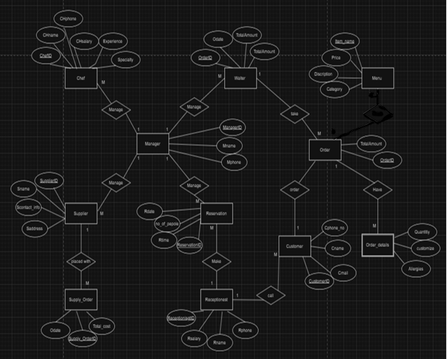
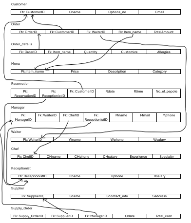

# Restaurant Management Database
Oracle SQL Database Project

##  Project Overview
A restaurant management database designed to support customers, orders, menu items, reservations, and staff operations.
The project includes ER modeling, relational schema design, SQL queries, and stored procedures.

The database was designed following normalization principles to ensure data integrity and reduce redundancy.

##  Database Scope
Main modules:
- Customers & Orders
- Menu Items & Order Details
- Reservations
- Employees (roles-based)

##  Implemented Components
- Table creation with primary/foreign keys
- Sample data insertion (5+ rows per table)
- 4 SQL queries (joins, aggregation, subquery)
- 2 stored procedures:
  - Parameter-based SELECT
  - UPDATE procedure

##  Technologies Used

- Oracle SQL
- Relational Database Design
- ER Modeling
- SQL Queries
- Stored Procedures
- 
##  Repository Structure

- [Create Tables](sql/01_create_tables.sql)
- [Insert Data](sql/02_insert_data.sql)
- [SQL Queries](sql/03_queries.sql)
- [Stored Procedures](sql/04_procedures.sql)

##  ER Diagram

##  Relational Schema

##  My Contribution
- Created database tables and populated sample data
- Implemented the required SQL queries

> Note: Stored procedures were implemented by a team member as part of the project distribution.

---

 University Project  
 Author: Toleen Wael
